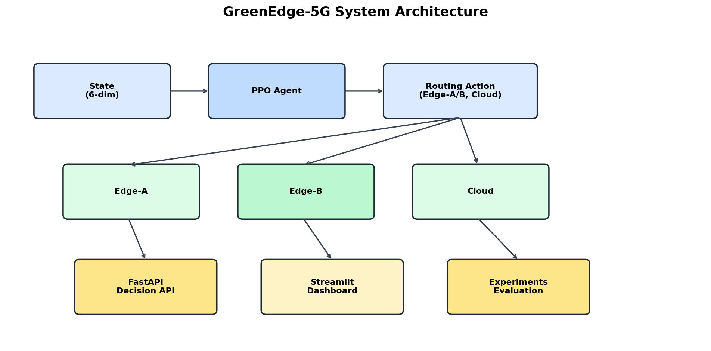
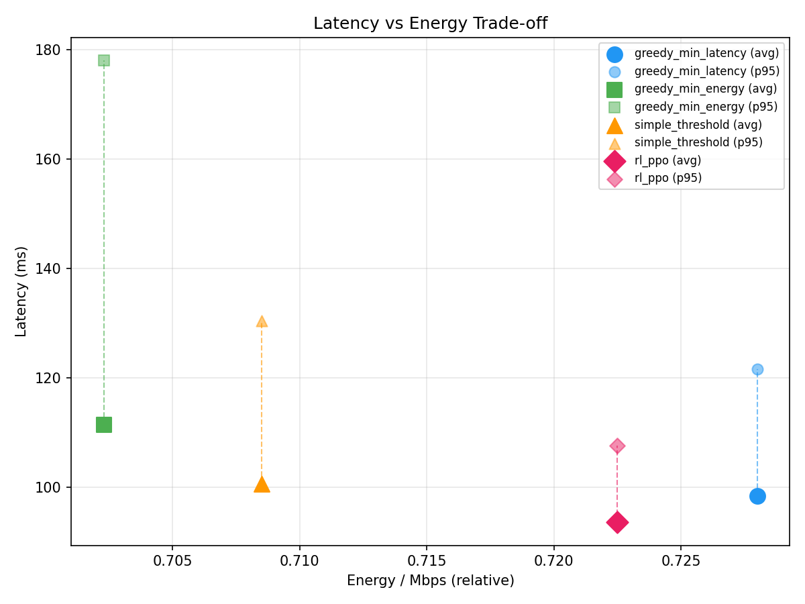

# GreenEdge-5G

> **AI-powered workload routing for 5G edge/cloud infrastructure — optimising energy and latency jointly via Reinforcement Learning.**

[](https://github.com/ZalOZKAN/greenedge-mvp/actions/workflows/ci.yml)
[](https://www.python.org/downloads/)

<table width="100%">
   <tr>
      <td width="74%" valign="top" style="border:1px solid #30363d; border-radius:8px; padding:14px 16px;">
         <h2>🚀 What is GreenEdge-5G?</h2>
         <p>GreenEdge-5G is an AI-powered decision engine that optimizes workload routing in 5G edge-cloud systems.</p>
         <p>Instead of static rules, it uses PPO-based Deep Reinforcement Learning to reduce SLA violations and improve system stability by learning from dynamic network conditions in the simulation setting.</p>
      </td>
      <td width="26%" valign="top" align="center" style="border:1px solid #30363d; border-radius:8px; padding:14px 10px;">
         <strong></strong><br/><br/>
         
      </td>
   </tr>
</table>

## 💡 Why it matters

- SLA violations can disrupt critical operations in industrial 5G networks
- Static routing fails under dynamic workloads
- Edge resources are limited and expensive

GreenEdge enables adaptive, learning-based decision making.

Result:
→ more stable systems
→ fewer SLA violations
→ better resource utilization

---

## 📌 Scope of the Project

GreenEdge-5G focuses on the decision-making layer of edge-cloud routing.

It is not a full 5G network stack, but a modular decision engine that can be integrated into existing systems.

---

## 1. Problem

In industrial Private 5G networks (smart factories, logistics hubs, low-latency edge deployments), fixed-rule routing — "always pick fastest server" or "always pick cheapest" — ignores temporal dynamics. Repeatedly routing to the same node causes resource saturation and SLA violations under variable load.

**GreenEdge-5G** models this as a Markov Decision Process and solves it with Proximal Policy Optimization (PPO), enabling the agent to learn a routing policy that balances **latency**, **energy consumption**, and **SLA compliance** simultaneously in the simulation setting.

---

## 2. Solution

A RL-based decision engine trained in a lightweight Gymnasium simulation of a 3-node 5G edge/cloud topology:

| Node | Latency profile | Energy profile |
|------|----------------|----------------|
| Edge-A | Low base (25 ms) + load-dependent | Higher per-Mbps |
| Edge-B | Medium base (30 ms) + load-dependent | Medium per-Mbps |
| Cloud | High base (65 ms) + WAN jitter | Lowest per-Mbps |

The trained PPO agent observes a 6-dimensional state vector and selects a more favorable routing target at each decision step.

---

## 3. Architecture

## 🏗️ System Architecture


## 📊 Results Overview


## 📺 Dashboard


```
                  ┌──────────┐
  Observation ──▶ │ RL Agent │──▶ Action (0/1/2)
  [6-dim vector]  │  (PPO)   │
                  └──────────┘
                       │
         ┌─────────────┼─────────────┐
         ▼             ▼             ▼
    ┌─────────┐  ┌─────────┐  ┌──────────┐
    │ edge-a  │  │ edge-b  │  │  cloud   │
    └─────────┘  └─────────┘  └──────────┘
         │
    ┌────▼─────┐    ┌──────────────┐    ┌──────────────┐
    │ FastAPI  │    │  Streamlit   │    │  Kubernetes  │
    │ Decision │    │  Dashboard   │    │  (k3s-ready) │
    │  Service │    │  + PDF       │    │              │
    └──────────┘    └──────────────┘    └──────────────┘
```

| Layer | Technology | Function |
|-------|-----------|----------|
| **UI** | Streamlit | KPI cards, charts, simulation, PDF export |
| **API** | FastAPI | `POST /decision`, `GET /health`, confidence score |
| **RL Engine** | Stable-Baselines3, PyTorch | PPO policy training and inference |
| **Simulator** | Gymnasium | MDP environment, reward computation |
| **Container** | Docker / k3s | Cloud-native deployment |

---

## 4. RL Formulation

### State Space (6-dim, all ∈ [0, 1])

| Index | Variable | Description |
|-------|----------|-------------|
| 0 | `cpu_a` | Edge-A CPU load |
| 1 | `cpu_b` | Edge-B CPU load |
| 2 | `q_a` | Edge-A queue ratio |
| 3 | `q_b` | Edge-B queue ratio |
| 4 | `link_q` | Link quality (1=perfect) |
| 5 | `energy_price` | Energy price signal |

### Action Space (Discrete 3)

| Action | Target | Characteristics |
|--------|--------|-----------------|
| 0 | Edge-A | Low latency, higher energy |
| 1 | Edge-B | Medium latency, medium energy |
| 2 | Cloud  | High latency, lowest energy |

### Reward Function

```
r = –( α × E_norm + β × L_norm + γ × SLA_scale × 𝟙_SLA )
```

| Parameter | Default | Role |
|-----------|---------|------|
| α (alpha) | **0.35** | Energy weight — penalises energy waste |
| β (beta) | **0.55** | Latency weight — dominant term; latency is the primary KPI |
| γ (gamma) | **0.10** | SLA penalty weight — applied when latency > 120 ms |
| `SLA_scale` | **1.0** | Multiplier on SLA penalty (tunable: 1×, 3×, 5×) |
| `E_norm` | `energy / 3.0` | Relative energy, normalised to ~[0,1] |
| `L_norm` | `latency_ms / 200.0` | Latency normalised to ~[0,1] |

**Why this formulation?**
- **β > α**: Latency is the primary SLA driver in 5G edge use cases; β is deliberately higher.
- **Binary SLA penalty (γ)**: The SLA boundary (120 ms) is a hard operational constraint. A discrete penalty encourages the agent to stay away from the boundary rather than trading off marginally.
- **Weights were tuned** via systematic grid search across α∈{0.3,0.35,0.4}, β∈{0.5,0.55,0.6}, SLA_scale∈{1,3,5}; the chosen set produced the lowest observed SLA violation rate without sacrificing latency stability in the simulation setting.

### Confidence Score & Fallback

A confidence score is computed for each decision:
```
confidence = max_softmax_probability
```
If `confidence < threshold`, the system falls back to the `greedy_min_latency` heuristic, ensuring safe operation during distributional shifts.

---

## 5. Results (Simulation Environment)

> ⚠️ **All results are produced in a simulated environment.** No real 5G field measurements were used. The simulation models node load dynamics, latency, and energy with simplified abstractions.
>
> *Multi-seed mean ± std is the primary reported metric for stability claims. Single-seed (seed=0) results are used for reproducible demos and dashboard display.*

### 5.0 Metrics at a Glance

SLA violation:
- PPO: 0.10% ± 0.02%
- Baseline: ~5.7%

Latency (P95):
- PPO: ~107 ms

Note:
Multi-seed evaluation is used to demonstrate stability.
Single-seed results are used for dashboard demos.

Energy per Mbps represents a normalized energy cost per unit of processed data in the simulation.

### 5.1 Primary Evaluation (seed=0) — 200 episodes, ~10 000 decision steps

Used for reproducible demos and dashboard display.

| Policy | Avg Reward | Avg Latency | P95 Latency | Energy/Mbps | SLA Violation% |
|--------|-----------|-------------|-------------|-------------|----------------|
| **rl_ppo** | **-17.09** | **93.60 ms** | **107.61 ms** | **0.7225** | **0.12%** |
| weighted_heuristic | -18.07 | 98.91 ms | 122.43 ms | 0.7079 | 6.72% |
| greedy_min_latency | -18.06 | 98.35 ms | 121.59 ms | 0.7280 | 5.79% |
| simple_threshold | -18.60 | 100.63 ms | 130.44 ms | 0.7085 | 12.56% |
| greedy_min_energy | -20.61 | 111.37 ms | 178.02 ms | 0.7023 | 24.03% |
| random_policy | -27.27 | 145.38 ms | 208.51 ms | 0.7724 | 55.40% |

> *Reproducible via `python -m greenedge.rl.evaluate --episodes 200 --seed 0`*

> **Note:** `random_policy` and `weighted_heuristic` are included in evaluation scripts for benchmarking purposes but are not exposed in the dashboard UI for simplicity.

### 5.2 Multi-seed Evaluation (seeds 0, 42, 123) — mean ± std

Used to demonstrate result stability across different environment initialisations.

| Policy | Avg Reward | Avg Latency | P95 Latency | SLA Violation% |
|--------|-----------|-------------|-------------|----------------|
| **rl_ppo** | **-17.01 ± 0.08** | **93.51 ± 0.10 ms** | **107.18 ± 0.42 ms** | **0.10% ± 0.02%** |
| weighted_heuristic | -18.05 ± 0.12 | 98.97 ± 0.06 ms | 122.63 ± 0.19 ms | 6.89% ± 0.20% |
| greedy_min_latency | -18.00 ± 0.12 | 98.32 ± 0.02 ms | 121.35 ± 0.17 ms | 5.69% ± 0.07% |
| simple_threshold | -18.56 ± 0.13 | 100.56 ± 0.12 ms | 130.56 ± 0.11 ms | 12.58% ± 0.09% |
| greedy_min_energy | -20.58 ± 0.04 | 111.39 ± 0.01 ms | 178.01 ± 0.26 ms | 24.19% ± 0.19% |
| random_policy | -27.42 ± 0.15 | 146.55 ± 0.88 ms | 209.27 ± 0.71 ms | 56.26% ± 0.61% |

*Source: `experiments/results_summary.json` — reproduced via `make multiseed`*

### Key findings (in the simulation setting)

SLA violation rate (multi-seed):
- PPO: 0.10% ± 0.02%
- greedy_min_latency: 5.69% ± 0.07%

Approximate improvement:
- ~48× reduction in SLA violations compared to greedy_min_latency
- based on single-seed evaluation (0.12% vs 5.79%)
- **P95 latency: 107.18 ± 0.42 ms** — consistently below the 120 ms SLA threshold across all seeds.
- **Latency mean: 93.51 ± 0.10 ms** — lower than greedy_min_latency (98.32 ms) while also using less energy (0.71 vs 0.72 Energy/Mbps), indicating a more favourable latency-energy trade-off in this simulation setup.
- **Stability:** SLA violation std of ±0.02 pp across seeds confirms the policy is not sensitive to environment initialisation.

All results are reproducible:
```bash
# Single seed (demo)
python -m greenedge.rl.evaluate --episodes 200 --seed 0
# Multi-seed (stability check)
python -m greenedge.rl.evaluate --episodes 200 --seeds 0 42 123
```

---

## ⚠️ Limitations

- Results are based on a simulated environment.
- No real-world 5G deployment yet.
- Latency and energy models are abstracted.
- Static topology is currently limited to 2 edge nodes + 1 cloud node.
- No systematic fault-injection campaign yet (node/link failures).

This project focuses on the decision engine (MVP), not full network deployment.

---

## 7. Deployment Path

The architecture is designed for progressive production onboarding:

```
[Current]   Simulation → validated policy → experiments/policy.zip
   ↓
[Step 1]    Shadow mode: deploy API alongside existing router; log decisions but don't act
   ↓
[Step 2]    A/B routing: serve 10% traffic via RL decision endpoint, compare KPIs
   ↓
[Step 3]    Full rollout: RL as primary router with heuristic fallback
   ↓
[Step 4]    Online learning: periodic policy retraining on real telemetry
```

| Component | Technology | Status |
|-----------|-----------|--------|
| Decision API | FastAPI (`POST /decision`) | ✅ Implemented |
| Container | Docker | ✅ Implemented |
| Orchestration | Kubernetes / k3s manifests | ✅ k8s/ directory |
| Edge abstraction | Gymnasium env | ✅ Simulation |
| Real telemetry | — | 🔲 Future work |
| Online retraining | — | 🔲 Future work |

---

## 8. Reproducibility

## ⚡ Quick Start

### 1. Install dependencies

```bash
pip install -r requirements.txt
```

### 2. Train PPO model

```bash
python -m greenedge.rl.train --algo ppo --steps 500000
```

### 3. Run evaluation

```bash
python -m greenedge.rl.evaluate --episodes 200
```

### 4. Launch dashboard

```bash
streamlit run greenedge/dashboard/app.py
```

## ⚡ Quick Run (Recommended)

```bash
make all
```

### Full setup and reproducibility

```powershell
git clone https://github.com/ZalOZKAN/greenedge-mvp.git
cd greenedge-mvp
python -m venv .venv
.\.venv\Scripts\Activate.ps1
pip install -r requirements.txt

# Full pipeline (train → evaluate → multi-seed summary)
make all

# Or step by step:
make train       # 500k step PPO training
make evaluate    # single-seed eval, updates results.json + plots
make multiseed   # 3-seed eval, writes results_summary.json (mean ± std)
make dashboard   # launch Streamlit UI
```

### Individual commands

```powershell
# Train
python -m greenedge.rl.train --algo ppo --steps 500000

# Evaluate (single seed)
python -m greenedge.rl.evaluate --episodes 200 --seed 0

# Evaluate (multi-seed, writes results_summary.json)
python -m greenedge.rl.evaluate --episodes 200 --seeds 0 42 123

# API server
python -m greenedge.api.main

# Dashboard
streamlit run greenedge/dashboard/app.py

# Tests
pytest tests/ -v

# Lint
ruff check greenedge/ tests/
```

### Project structure

```
greenedge-mvp/
├── greenedge/
│   ├── simulator/         # Gymnasium MDP environment & reward model
│   ├── rl/                # PPO training, evaluation, baselines
│   ├── api/               # FastAPI decision service
│   └── dashboard/         # Streamlit UI with PDF export
├── tests/                 # Pytest test suite
├── experiments/           # Trained models, results.json, results_summary.json, plots
├── k8s/                   # Kubernetes deployment manifests
├── docs/                  # Technical report, demo guide
├── Makefile               # Single-command reproducibility
├── Dockerfile             # Container build
├── requirements.txt       # Production dependencies
└── requirements-dev.txt   # Development dependencies
```

---

## CI/CD

GitHub Actions pipeline: **Ruff lint** → **Pytest** → **Mypy type check** → **Docker Build** (on lint+test pass).

---

## 🧠 Key Takeaway

GreenEdge-5G demonstrates that replacing static routing rules with learning-based decision systems can significantly improve stability in dynamic edge-cloud environments.

---

*GreenEdge-5G — Simulation-validated AI for 5G workload routing.*
