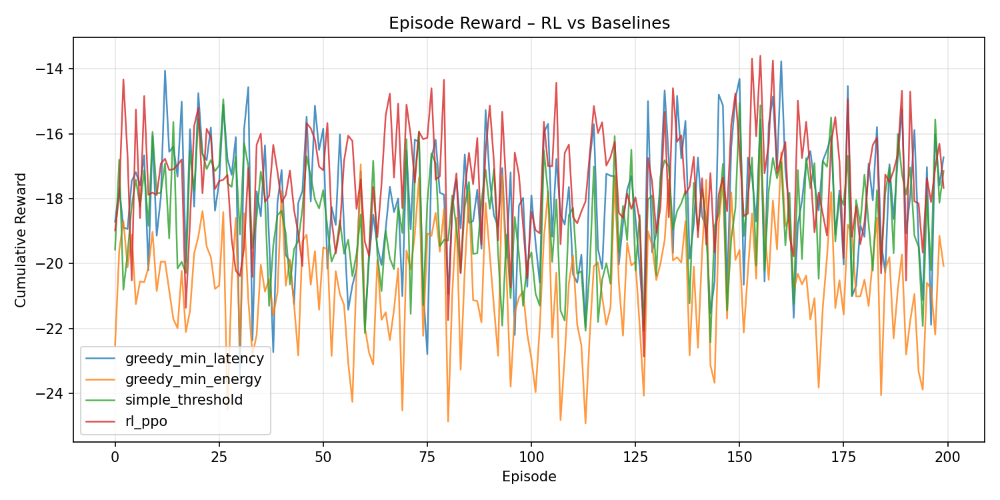
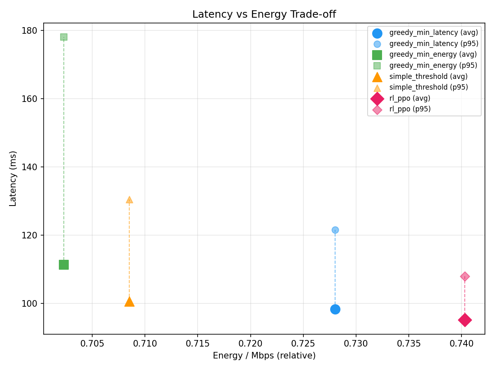

# GreenEdge-5G — MVP Report

## 1. Overview

GreenEdge-5G is an RL-based decision engine that routes workloads across a heterogeneous 5G infrastructure consisting of two edge nodes (**edge-a**, **edge-b**) and a **cloud** backend. The system optimises a multi-objective function balancing **latency**, **energy consumption**, and **SLA compliance**.

### Architecture

```
                  ┌──────────┐
  Observation ──▶ │  RL Agent │──▶ Action (0/1/2)
  [6-dim vector]  │  (PPO)   │
                  └──────────┘
                       │
         ┌─────────────┼─────────────┐
         ▼             ▼             ▼
    ┌─────────┐  ┌─────────┐  ┌──────────┐
    │ edge-a  │  │ edge-b  │  │  cloud   │
    └─────────┘  └─────────┘  └──────────┘
```

**Observation vector (6-dim):** `[cpu_a, cpu_b, queue_a, queue_b, link_quality, energy_price]`

**Reward function:**

$$
r = -(\alpha \cdot E_{norm} + \beta \cdot L_{norm} + \gamma \cdot \mathbb{1}_{SLA})
$$

Default weights: α = 0.35 (energy), β = 0.55 (latency), γ = 0.10 (SLA penalty).

---

## 2. KPI Results (200 episodes)

| Policy | Avg Reward | Avg Latency (ms) | P95 Latency (ms) | Energy/Mbps | SLA Violation % |
|--------|-----------|-------------------|-------------------|-------------|-----------------|
| **rl_ppo** | **-17.41** | **95.15** | **107.97** | 0.7403 | **0.18%** |
| greedy_min_latency | -18.06 | 98.35 | 121.59 | 0.7280 | 5.79% |
| simple_threshold | -18.60 | 100.63 | 130.44 | 0.7085 | 12.56% |
| greedy_min_energy | -20.61 | 111.37 | 178.02 | 0.7023 | 24.03% |

### Key findings

- **RL (PPO) achieves the best overall reward** (-17.41) by learning to balance all three objectives simultaneously.
- **SLA compliance:** RL keeps violations at 0.18% — 30× better than the best baseline (greedy_min_latency at 5.79%).
- **P95 latency:** RL's 107.97 ms stays safely under the 120 ms SLA threshold, while all baselines exceed it at the 95th percentile.
- **Trade-off:** RL uses slightly more energy (0.74 vs 0.70) but gains substantially on latency and SLA. This is the optimal Pareto trade-off.

---

## 3. Plots

### 3.1 Episode Reward Comparison



The RL agent (blue) consistently achieves higher episode rewards across 200 evaluation episodes compared to all three baselines.

### 3.2 Latency vs Energy Trade-off



RL occupies the **Pareto-optimal** position: lowest latency with only marginally higher energy. The energy-greedy baseline saves energy but at the cost of massive SLA violations.

---

## 4. Components

| Component | Command | Port |
|-----------|---------|------|
| Simulator | `python -m greenedge.simulator.smoke_test` | — |
| Training | `python -m greenedge.rl.train --algo ppo --steps 20000` | — |
| Evaluation | `python -m greenedge.rl.evaluate --episodes 200` | — |
| API | `python -m greenedge.api.main` | 8000 |
| Dashboard | `streamlit run greenedge/dashboard/app.py` | 8501 |

---

## 5. Conclusion

The PPO-based RL agent demonstrates clear advantages over hand-crafted baselines in a simulated 5G edge-cloud routing scenario. It learns to make context-aware routing decisions that minimise latency while maintaining near-zero SLA violations — a critical requirement for 5G applications. The confidence-based fallback mechanism ensures safe operation when the agent is uncertain.
